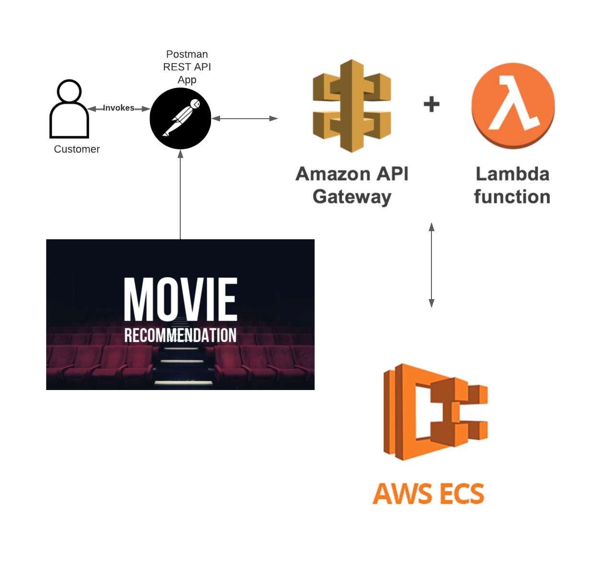
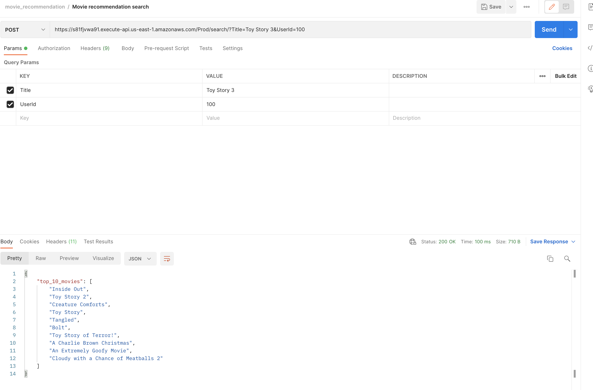
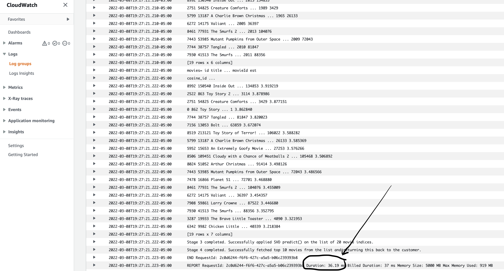

# movie-recommender-app

Movie-search-recommendations: 
I brought in ideas from content based filtering and collaborative filtering to build an engine that gave movie suggestions to a particular user based on the estimated ratings that it had internally calculated for that user. 
Github link to the inference server. (link)

Content Based Filtering: I built a content based engine which took the following features as input to come up with movie based recommendations.
Cast - Actors, Actresses names
Crew - Director name (3x priority).
Genre
Keywords 
to come up with predictions. I modified it to give higher precedence to movies with more votes and higher ratings. I exported the cosine similarity matrix numpy array that could be consumed by the online inference engine.

Collaborative Filtering: I used the powerful Surprise Library to build a collaborative filter based on single value decomposition (SVD). The RMSE (Root Mean squared Error) obtained was less than 1 and the engine gave estimated ratings for a given user and movie. I trained the SVD model using 10,000 movie ratings provided by 5000 users from the TMDB dataset.


Movie-Recommendations - End-to-End Architecture



This project contains source code and supporting files for a serverless application for classifying handwritten digits using a Machine Learning model in [scikit-learn](https://scikit-learn.org/). It includes the following files and folders:

- app/app.py - Code for the application's Lambda function including the code for ML inferencing.
- app/Dockerfile - The Dockerfile to build the container image.
- app/model - A simple scikit-learn logistic regression model for classifying handwritten digits trained against the MNIST dataset.
- app/requirements.txt - The pip requirements to be installed during the container build.
- events - Invocation events that you can use to invoke the function.
- template.yaml - A template that defines the application's AWS resources.

The application uses several AWS resources, including Lambda functions and an API Gateway API. These resources are defined in the `template.yaml` file in this project. You can update the template to add AWS resources through the same deployment process that updates your application code.

## Deploy the sample application

The Serverless Application Model Command Line Interface (SAM CLI) is an extension of the AWS CLI that adds functionality for building and testing Lambda applications. It uses Docker to run your functions in an Amazon Linux environment that matches Lambda. It can also emulate your application's build environment and API.

To use the SAM CLI, you need the following tools.

* SAM CLI - [Install the SAM CLI](https://docs.aws.amazon.com/serverless-application-model/latest/developerguide/serverless-sam-cli-install.html)
* Docker - [Install Docker community edition](https://hub.docker.com/search/?type=edition&offering=community)

You may need the following for local testing.
* [Python 3 installed](https://www.python.org/downloads/)

To build and deploy your application for the first time, run the following in your shell:

```bash
sam build
sam deploy --guided
```

The first command will build a docker image from a Dockerfile and then copy the source of your application inside the Docker image. The second command will package and deploy your application to AWS, with a series of prompts:

* **Stack Name**: The name of the stack to deploy to CloudFormation. This should be unique to your account and region, and a good starting point would be something matching your project name.
* **AWS Region**: The AWS region you want to deploy your app to.
* **Confirm changes before deploy**: If set to yes, any change sets will be shown to you before execution for manual review. If set to no, the AWS SAM CLI will automatically deploy application changes.
* **Allow SAM CLI IAM role creation**: Many AWS SAM templates, including this example, create AWS IAM roles required for the AWS Lambda function(s) included to access AWS services. By default, these are scoped down to minimum required permissions. To deploy an AWS CloudFormation stack which creates or modifies IAM roles, the `CAPABILITY_IAM` value for `capabilities` must be provided. If permission isn't provided through this prompt, to deploy this example you must explicitly pass `--capabilities CAPABILITY_IAM` to the `sam deploy` command.
* **Save arguments to samconfig.toml**: If set to yes, your choices will be saved to a configuration file inside the project, so that in the future you can just re-run `sam deploy` without parameters to deploy changes to your application.

You can find your API Gateway Endpoint URL in the output values displayed after deployment.

## Use the SAM CLI to build and test locally

Build your application with the `sam build` command.

```bash
movie-recommender-app$ sam build
```

The SAM CLI builds a docker image from a Dockerfile and then installs dependencies defined in `app/requirements.txt` inside the docker image. The processed template file is saved in the `.aws-sam/build` folder.

Test a single function by invoking it directly with a test event. An event is a JSON document that represents the input that the function receives from the event source. Test events are included in the `events` folder in this project.

Run functions locally and invoke them with the `sam local invoke` command.

```bash
movie-recommender-app$ sam local invoke InferenceFunction --event events/event.json
```

The SAM CLI can also emulate your application's API. Use the `sam local start-api` to run the API locally on port 3000.

```bash
movie-recommender-app$ sam local start-api
movie-recommender-app$ curl http://localhost:3000/search/
```

### Matrix Factorization-based algorithms
```
class surprise.prediction_algorithms.matrix_factorization.SVD
Bases: surprise.prediction_algorithms.algo_base.AlgoBase
The famous SVD algorithm, as popularized by Simon Funk during the Netflix Prize. When baselines are not used, this is equivalent to Probabilistic Matrix Factorization [salakhutdinov2008a] (see note below).
```
https://surprise.readthedocs.io/en/stable/matrix_factorization.html#surprise.prediction_algorithms.matrix_factorization.SVD

```yaml
      Events:
        Inference:
          Type: Api
          Properties:
            Path: /search
            Method: post
```

## Add a resource to your application
The application template uses AWS Serverless Application Model (AWS SAM) to define application resources. AWS SAM is an extension of AWS CloudFormation with a simpler syntax for configuring common serverless application resources such as functions, triggers, and APIs. For resources not included in [the SAM specification](https://github.com/awslabs/serverless-application-model/blob/master/versions/2016-10-31.md), you can use standard [AWS CloudFormation](https://docs.aws.amazon.com/AWSCloudFormation/latest/UserGuide/aws-template-resource-type-ref.html) resource types.

## Fetch, tail, and filter Lambda function logs

To simplify troubleshooting, SAM CLI has a command called `sam logs`. `sam logs` lets you fetch logs generated by your deployed Lambda function from the command line. In addition to printing the logs on the terminal, this command has several nifty features to help you quickly find the bug.

`NOTE`: This command works for all AWS Lambda functions; not just the ones you deploy using SAM.

```bash
movie-recommender-app$ sam logs -n InferenceFunction --stack-name movie-recommender-app --tail
```

You can find more information and examples about filtering Lambda function logs in the [SAM CLI Documentation](https://docs.aws.amazon.com/serverless-application-model/latest/developerguide/serverless-sam-cli-logging.html).

## Cleanup

To delete the sample application that you created, use the AWS CLI. Assuming you used your project name for the stack name, you can run the following:

```bash
aws cloudformation delete-stack --stack-name movie-recommender-app
```

## Resources

See the [AWS SAM developer guide](https://docs.aws.amazon.com/serverless-application-model/latest/developerguide/what-is-sam.html) for an introduction to SAM specification, the SAM CLI, and serverless application concepts.

Next, you can use AWS Serverless Application Repository to deploy ready to use Apps that go beyond hello world samples and learn how authors developed their applications: [AWS Serverless Application Repository main page](https://aws.amazon.com/serverless/serverlessrepo/)

##  sam deploy --guided
```
Configuring SAM deploy
======================

	Looking for config file [samconfig.toml] :  Not found

	Setting default arguments for 'sam deploy'
	=========================================
	Stack Name [sam-app]: movie-recommender-app
	AWS Region [us-east-1]: 
	#Shows you resources changes to be deployed and require a 'Y' to initiate deploy
	Confirm changes before deploy [y/N]: y
	#SAM needs permission to be able to create roles to connect to the resources in your template
	Allow SAM CLI IAM role creation [Y/n]: y
	#Preserves the state of previously provisioned resources when an operation fails
	Disable rollback [y/N]: n
	InferenceFunction may not have authorization defined, Is this okay? [y/N]: y
	Save arguments to configuration file [Y/n]: y
	SAM configuration file [samconfig.toml]: 
	SAM configuration environment [default]: 

	Looking for resources needed for deployment:
	 Managed S3 bucket: aws-sam-cli-managed-default-samclisourcebucket-kcec0inoid7z
	 A different default S3 bucket can be set in samconfig.toml
	 Image repositories: Not found.
	 #Managed repositories will be deleted when their functions are removed from the template and deployed
	 Create managed ECR repositories for all functions? [Y/n]: y

	Saved arguments to config file
	Running 'sam deploy' for future deployments will use the parameters saved above.
	The above parameters can be changed by modifying samconfig.toml
	Learn more about samconfig.toml syntax at 
	https://docs.aws.amazon.com/serverless-application-model/latest/developerguide/serverless-sam-cli-config.html

5d377e1581e3: Pushed 
f18ddcde619f: Pushed 
bdaba102eada: Pushed 
dbf62db65526: Pushed 
9d80e9d9c669: Pushed 
0f2cd2ab5fc1: Pushed 
2b9913d02f84: Pushed 
26954cc2f850: Pushed 
8b0dc5462dd1: Pushed 
4f464b9377e3: Pushed 
inferencefunction-63e6cf3c427d-python3.8-v1: digest: sha256:936ad3203bb266f8a213a55fd6b1bbb339d15d3d281d7464a62a529b586637e6 size: 2428

	Deploying with following values
	===============================
	Stack name                   : movie-recommender-app
	Region                       : us-east-1
	Confirm changeset            : True
	Disable rollback             : False
	Deployment image repository  : 
                                       {
                                           "InferenceFunction": "943742432997.dkr.ecr.us-east-1.amazonaws.com/movierecommenderapp32c96c14/inferencefunction7c73919drepo"
                                       }
	Deployment s3 bucket         : aws-sam-cli-managed-default-samclisourcebucket-kcec0inoid7z
	Capabilities                 : ["CAPABILITY_IAM"]
	Parameter overrides          : {}
	Signing Profiles             : {}

Initiating deployment
=====================
InferenceFunction may not have authorization defined.
Uploading to movie-recommender-app/ea29d86bd6173959b6d3121d00f45aa0.template  1296 / 1296  (100.00%)

Waiting for changeset to be created..

CloudFormation stack changeset
-------------------------------------------------------------------------------------------------------------------------------------------------------------
Operation                               LogicalResourceId                       ResourceType                            Replacement                           
-------------------------------------------------------------------------------------------------------------------------------------------------------------
+ Add                                   InferenceFunctionInferencePermissionP   AWS::Lambda::Permission                 N/A                                   
                                        rod                                                                                                                   
+ Add                                   InferenceFunctionRole                   AWS::IAM::Role                          N/A                                   
+ Add                                   InferenceFunction                       AWS::Lambda::Function                   N/A                                   
+ Add                                   ServerlessRestApiDeployment6bf70aefc9   AWS::ApiGateway::Deployment             N/A                                   
+ Add                                   ServerlessRestApiProdStage              AWS::ApiGateway::Stage                  N/A                                   
+ Add                                   ServerlessRestApi                       AWS::ApiGateway::RestApi                N/A                                   
-------------------------------------------------------------------------------------------------------------------------------------------------------------

Changeset created successfully. arn:aws:cloudformation:us-east-1:943742432997:changeSet/samcli-deploy1646697905/dfa5f6a1-816a-46f6-b1e5-e57ed1d4a551


Previewing CloudFormation changeset before deployment
======================================================
Deploy this changeset? [y/N]: y

2022-03-07 19:05:19 - Waiting for stack create/update to complete

CloudFormation events from stack operations
-------------------------------------------------------------------------------------------------------------------------------------------------------------
ResourceStatus                          ResourceType                            LogicalResourceId                       ResourceStatusReason                  
-------------------------------------------------------------------------------------------------------------------------------------------------------------
CREATE_IN_PROGRESS                      AWS::IAM::Role                          InferenceFunctionRole                   -                                     
CREATE_IN_PROGRESS                      AWS::IAM::Role                          InferenceFunctionRole                   Resource creation Initiated           
CREATE_COMPLETE                         AWS::IAM::Role                          InferenceFunctionRole                   -                                     
CREATE_IN_PROGRESS                      AWS::Lambda::Function                   InferenceFunction                       -                                     
CREATE_IN_PROGRESS                      AWS::Lambda::Function                   InferenceFunction                       Resource creation Initiated           
CREATE_COMPLETE                         AWS::Lambda::Function                   InferenceFunction                       -                                     
CREATE_IN_PROGRESS                      AWS::ApiGateway::RestApi                ServerlessRestApi                       -                                     
CREATE_IN_PROGRESS                      AWS::ApiGateway::RestApi                ServerlessRestApi                       Resource creation Initiated           
CREATE_COMPLETE                         AWS::ApiGateway::RestApi                ServerlessRestApi                       -                                     
CREATE_IN_PROGRESS                      AWS::Lambda::Permission                 InferenceFunctionInferencePermissionP   -                                     
                                                                                rod                                                                           
CREATE_IN_PROGRESS                      AWS::ApiGateway::Deployment             ServerlessRestApiDeployment6bf70aefc9   -                                     
CREATE_IN_PROGRESS                      AWS::Lambda::Permission                 InferenceFunctionInferencePermissionP   Resource creation Initiated           
                                                                                rod                                                                           
CREATE_IN_PROGRESS                      AWS::ApiGateway::Deployment             ServerlessRestApiDeployment6bf70aefc9   Resource creation Initiated           
CREATE_COMPLETE                         AWS::ApiGateway::Deployment             ServerlessRestApiDeployment6bf70aefc9   -                                     
CREATE_IN_PROGRESS                      AWS::ApiGateway::Stage                  ServerlessRestApiProdStage              -                                     
CREATE_IN_PROGRESS                      AWS::ApiGateway::Stage                  ServerlessRestApiProdStage              Resource creation Initiated           
CREATE_COMPLETE                         AWS::ApiGateway::Stage                  ServerlessRestApiProdStage              -                                     
CREATE_COMPLETE                         AWS::Lambda::Permission                 InferenceFunctionInferencePermissionP   -                                     
                                                                                rod                                                                           
CREATE_COMPLETE                         AWS::CloudFormation::Stack              movie-recommender-app                   -                                     
-------------------------------------------------------------------------------------------------------------------------------------------------------------

CloudFormation outputs from deployed stack
---------------------------------------------------------------------------------------------------------------------------------------------------------------
Outputs                                                                                                                                                       
---------------------------------------------------------------------------------------------------------------------------------------------------------------
Key                 InferenceApi                                                                                                                              
Description         API Gateway endpoint URL for Prod stage for Inference function                                                                            
Value               https://hmf8g7ck28.execute-api.us-east-1.amazonaws.com/Prod/search/                                                                       

Key                 InferenceFunctionIamRole                                                                                                                  
Description         Implicit IAM Role created for Inference function                                                                                          
Value               arn:aws:lambda:us-east-1:943742432997:function:movie-recommender-app-InferenceFunction-Tmjq8wJbMWjN                                       

Key                 InferenceFunction                                                                                                                         
Description         Inference Lambda Function ARN                                                                                                             
Value               arn:aws:lambda:us-east-1:943742432997:function:movie-recommender-app-InferenceFunction-Tmjq8wJbMWjN                                       
---------------------------------------------------------------------------------------------------------------------------------------------------------------

Successfully created/updated stack - movie-recommender-app in us-east-1

```


## Verification:
Use Postman Application to invoke a REST API (POST) request to the exposed API.



STEP 4:
Observe the CloudWatch logs to see the model load time latency and latency for SVD model loading time.



Observations:
It is found that there is cold start latency incurred with Lambda functions which results in the first few run-time inferences taking more than 50 seconds and that causes the API to timeout.
However the subsequent API requests take less than 30 msec as the Lambda function is already running in an active EC2 instance.There are multiple ways to mitigate the runtime of Lambda functions in a cold state. Lambda supports provisioned concurrency to keep the functions initialized.
